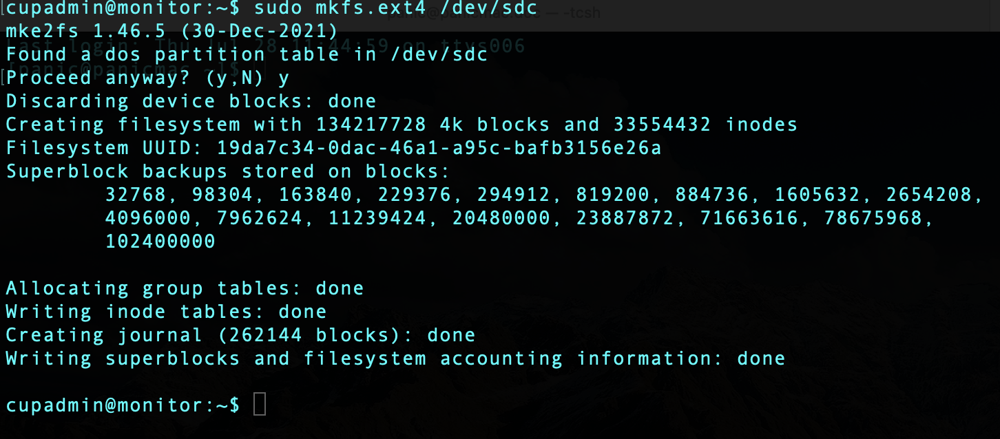
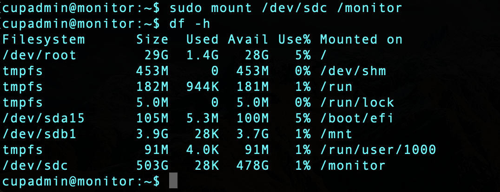

# VM Machine Setting

### Monitor Server
IP  : 20.214.182.107

DNS : ymmonitor.koreacentral.cloudapp.azure.com

* Login with cupadmin & public_key

## First Login
* Change password

	</img>

* Sudo permission
	* `sudo nano /etc/sudoers`
	* Add `cupadmin ALL=NOPASSWD: ALL`

* Mount additional disk
	* `lsblk -o NAME,HCTL,SIZE,MOUNTPOINT |grep -i "sd"`

	</img>

* Write new partition
	* `sudo fdisk /dev/sdc`
	* `n` &rarr; `p` &rarr; `1` &rarr; `Enter` &rarr; `+256M` &rarr; `p`
	* Save with `w`

	</img>

* Format with ext4
	* `sudo mkfs.ext4 /dev/sdc`
	
	</img>
	
* Mount
	* `sudo mkdir /monitor`
	* `sudo mount /dev/sdc /monitor`
	* `sudo chown cupadmin:cupadmin /monitor`
	
	</img>
	
* Auto mount (After reboot)
	* Find `uuid`
		* `sudo blkid` 
		
	</img>

	* Edit `/etc/fstab`
	
	</img>
		
* Update packages
	* `sudo apt update`

* (option) Install emacs
	* `sudo apt install emacs`

* Timezone
	* `sudo ln -sf /usr/share/zoneinfo/Asia/Seoul /etc/localtime`